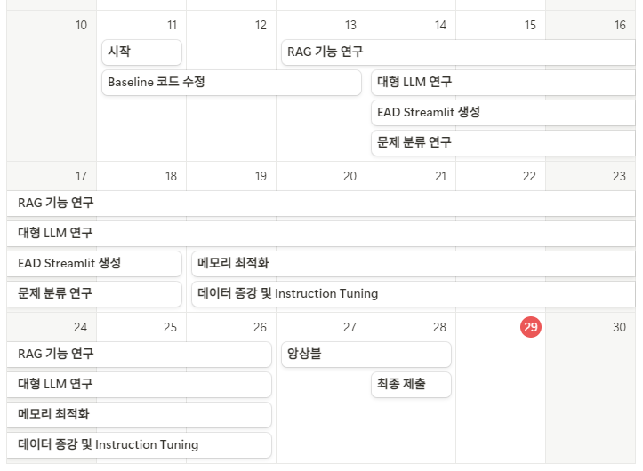
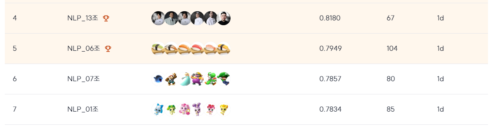
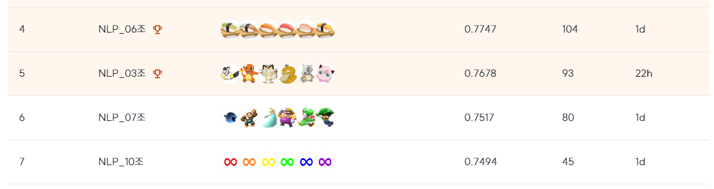

# CSAT-Solver Project (수능형 문제 풀이 모델)

## 대회 소개
`CSAT-Solver`는 고급 언어 모델을 사용하여 한국의 대학수학능력시험 문제를 해결하기 위해 설계된 프로젝트입니다. 이 프로젝트는 대규모 언어 모델에 미세 조정 기법을 적용하여 CSAT의 전형적인 객관식 문제에 대한 성능을 향상시킵니다.

## 팀원
<h2 align="center">NLP-7조 NOTY</h3>
<table align="center">
  <tr height="100px">
    <td align="center" width="150px">
      <a href="https://github.com/Uvamba"></a>
    </td>
    <td align="center" width="150px">
      <a href="https://github.com/doraemon500"></a>
    </td>
    <td align="center" width="150px">
      <a href="https://github.com/simigami"></a>
    </td>
    <td align="center" width="150px">
      <a href="https://github.com/DDUKDAE"></a>
    </td>
    <td align="center" width="150px">
      <a href="https://github.com/mrsuit0114"></a>
    </td>
    <td align="center" width="150px">
      <a href="https://github.com/hskhyl"></a>
    </td>
  </tr>
  <tr height="10px">
    <td align="center" width="150px">
      <a href="https://github.com/Uvamba">강신욱</a>
    </td>
    <td align="center" width="150px">
      <a href="https://github.com/doraemon500">박규태</a>
    </td>
    <td align="center" width="150px">
      <a href="https://github.com/simigami">이정민</a>
    </td>
    <td align="center" width="150px">
      <a href="https://github.com/DDUKDAE">장요한</a>
    </td>
    <td align="center" width="150px">
      <a href="https://github.com/mrsuit0114">한동훈</a>
    </td>
    <td align="center" width="150px">
      <a href="https://github.com/hskhyl">홍성균</a>
    </td>
  </tr>
</table>

## 팀원 역할
<div align='center'>

| 팀원  | 역할                                                                     |
|-----|------------------------------------------------------------------------|
| 이정민 | Team Leader, Baseline code, LLM Memory Optimization, Data Augmentation |
| 강신욱 | EDA, Data Augmentation                                                 |
| 박규태 | LLM Model Search, RAG Pipeline Analysis                                |
| 장요한 | LLM Model Search, Data Augmentation                                    |
| 한동훈 | EDA Streamlit, LLM Memory Optimization, Data Augmentation              |
| 홍성균 | LLM Model Search, Data Augmentation                                    |

</div>

## 프로젝트 기간
11월 11일 (월) 10:00 ~ 11월 28일 (목) 19:00

## 프로젝트 진행 과정.
<div align='center'>
  


</div>

# 설정 및 사용법

### 1. `requirements.txt`를 통해 필요한 라이브러리 설치

```bash
pip install -r requirements.txt
```

### 2. 훈련 및 테스트 데이터셋을 `data` 디렉토리에 배치

### 3. `arguments.py`에서 학습 진행할 모델 이름, max sequence length, chat template 등 여러 인자들 설정

```python
@dataclass
class ModelArguments:
    """
    Arguments pertaining to which model/config/tokenizer we are going to fine-tune from.
    """
    model_name_or_path: str = field(
        default='beomi/gemma-ko-2b', # 사용할 모델
    )
    train_test_split: Optional[float] = field(
        default=0.1,
        metadata={
            "help": "test_size"
        },
    )
    .
    .
    .

```

### 3. `run.py` 스크립트를 실행하여 훈련 및 추론 프로세스를 시작

```bash
python run.py
```

# 주요 기능

- 사전 훈련된 언어 모델(예: Gemma-ko-2b)의 미세 조정
- 4비트 및 8비트 양자화 지원
- CSAT 스타일 문제에 대한 맞춤형 데이터 처리
- 훈련 및 평가 파이프라인
- 테스트 데이터셋에 대한 추론
- Weights & Biases를 통한 실험 추적 통합

## streamlit_app.py

Streamlit 기반의 EDA 제공하여 시각화 자료를 로컬로 손쉽게 제공합니다.
- 패턴 기반 ID 조회
- 전체 데이터셋 표시
- 길이 분포 시각화
- 토큰화된 길이 분포 시각화
- 채팅 템플릿 적용 후 토큰화 길이 분포
- 답변 분포 표시

# 프로젝트 구조

```plaintext
CSAT-Solver/
│
├── data/
│ ├── train.csv
│ └── test.csv
│
├── models/                 # LoRA 학습된 adapter 저장 디렉토리
│
├── output/                 # test.csv로 inference 결과 저장 디렉토리
│
├── src/
│   ├── arguments.py        # 학습에 필요한 여러 인자
│   ├── utils.py            # 시드 고정 및 데이터 셋 chat message 형태로 변환
│   ├── streamlit_app.py    # EDA 시각화 제공 프로그램
│   ├── main.py             # 모델 학습 및 추론
│   ├── ensemble.py         # 추론 결과 앙상블
│   ├── backtranslation_augmentation.py # 역번역 증강
│   └── retrieval_tasks/    # RAG 파이프라인 코드 디렉토리
│       ├── __init__.py
│       ├── LLM_tasks.py          # LLM을 활용한 파이프라인 중의 요약 및 확인 task
│       ├── retrieval.py          # 리트리버 공통 추상 클래스
│       ├── retrieval_semantic.py # Dense 
│       ├── retrieval_syntactic.py # Sparse
│       ├── retrieval_hybrid.py   # 하이브리드 서치 
│       ├── retrieval_rerank.py   # two-stage reranker 
│       └── retrieve_utils.py     # RAG 기반 검색·요약 파이프라인
│
├── requirements.txt
├── README.md
└── run.py                  # 실행 파일
```
---

## Leader Board
### Private 6위

### Public 6위

